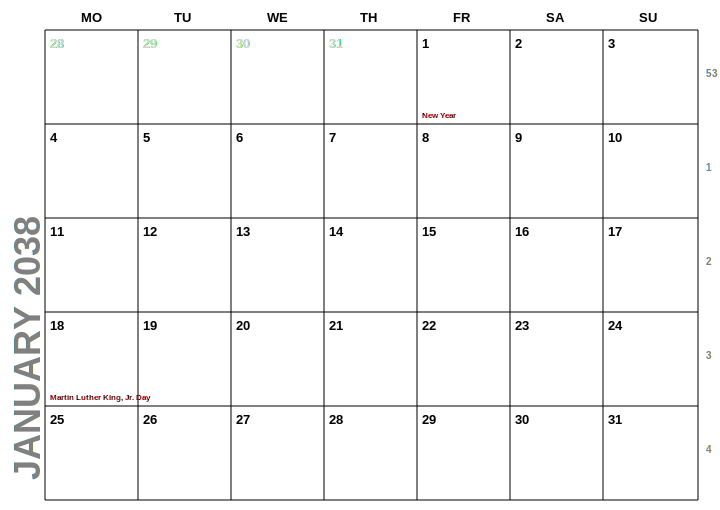
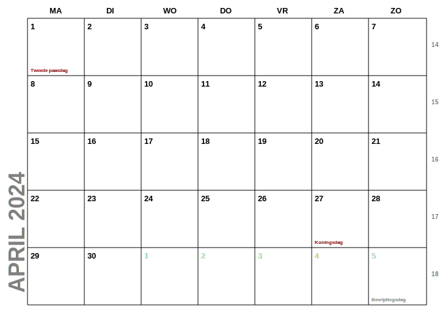

# Calendar-svg
Generate calendar images per month on A4 format, including national holidays. Ideal for printing
your very own calendar.

## Usage

You can create images per month or year. The images are in SVG format 
([Scalable Vector Format](https://en.wikipedia.org/wiki/SVG)). They have the A4 aspect ratio (same as A3, A5, etc.),
making the images ideal for printing.

## How to generate a calendar

From the command line, just run:

```bash
generate_calendar.sh
```

This will generate a calendar for the current year. For generating other years, or one month only, you can
specify parameters, here's how to print january 2038:

```bash
./generate_calendar.sh  --year=2038 --month=1
```

It will look a bit like this:



By default, the calendar pages are in English, using US holidays. To change this, use the `country` and
`language` parameters, for example:

```bash
./generate_calendar.sh --language=nl --country=NL
```

Resulting in image like this:



For full options consult the help:

```bash
./generate_calendar.sh --help
```

## Acknowledgements

Thanks to the kind people of Jollyday and KSVG who made this project possible (or at least much easier!).

### Jollyday

A great Java library of public holidays for almost every country in the world.

[github.com/focus-shift/jollyday](https://github.com/focus-shift/jollyday)

### KSVG

A Kotlin library to easily draw stuff and turn it into SVG images.

[github.com/nwillc/ksvg](https://github.com/nwillc/ksvg)
