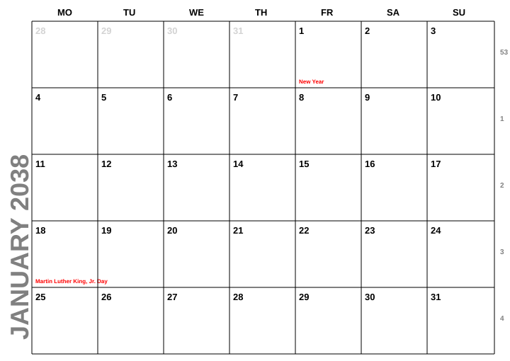
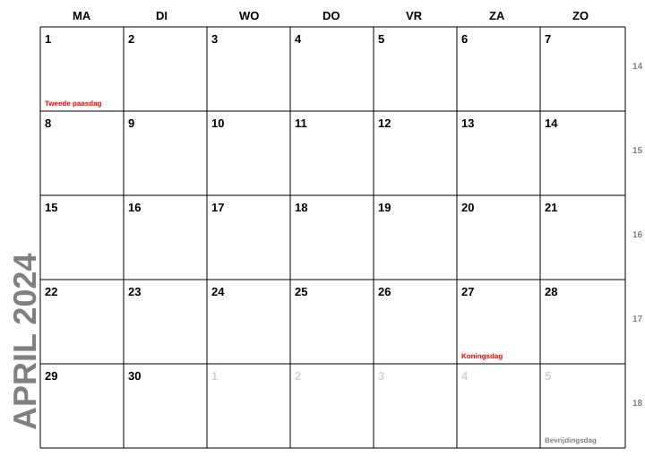
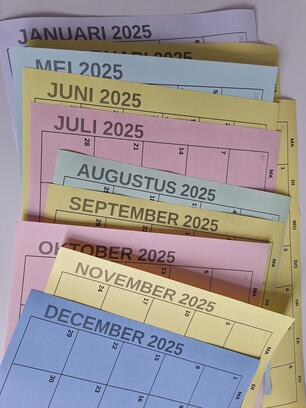

# Calendar-svg
Generate calendar images per month on A4 format, including national holidays and week numbers. Ideal for printing
your very own calendar.

## Usage

You can create images per month or year. The images are in SVG format 
([Scalable Vector Graphics Format](https://en.wikipedia.org/wiki/SVG)). They have the A4 aspect ratio (same as A3, A5, etc.),
making the images ideal for printing.

## How to generate a calendar

From the command line, just run:

```bash
./generate_calendar.sh
```

This will generate a calendar for the current year. For generating other years, or one month only, you can
specify additional parameters. Here's how to print january 2038:

```bash
./generate_calendar.sh  --year=2038 --month=1
```

It will look a bit like this:



By default, the calendar pages are in English, using US holidays. To change this, use the `country` and
`language` parameters, for example:

```bash
./generate_calendar.sh --language=nl --country=NL
```

Resulting in an image like this:



To see all options, consult the help page:

```bash
./generate_calendar.sh --help
```

## Printing the calendar pages

An easy way to print the pages is with a webbrowser. Open one of the `.svg` files you just generated in the browser, and
press <ctrl+p> to open the print dialog. As the image is already in A4 format, the aspect ratio should be fine for 
printing to any [A-series paper size](https://en.wikipedia.org/wiki/Paper_size#International_standard_paper_sizes).
Make sure you to select _landscape printing_ mode and set _'Margins'_ to _none_. For me, the option 
_'Fit to page width'_ does not cover the whole page in landscape mode, so I manually set the scale to `154%` for
full page coverage (ymmmv).



## Acknowledgements

Thanks to the kind people of Jollyday and KSVG who made this project possible (or at least much easier!).

### Jollyday

A great Java library of public holidays for almost every country in the world.

[github.com/focus-shift/jollyday](https://github.com/focus-shift/jollyday)

### KSVG

A Kotlin library to easily draw stuff and turn it into SVG images.

[github.com/nwillc/ksvg](https://github.com/nwillc/ksvg)
